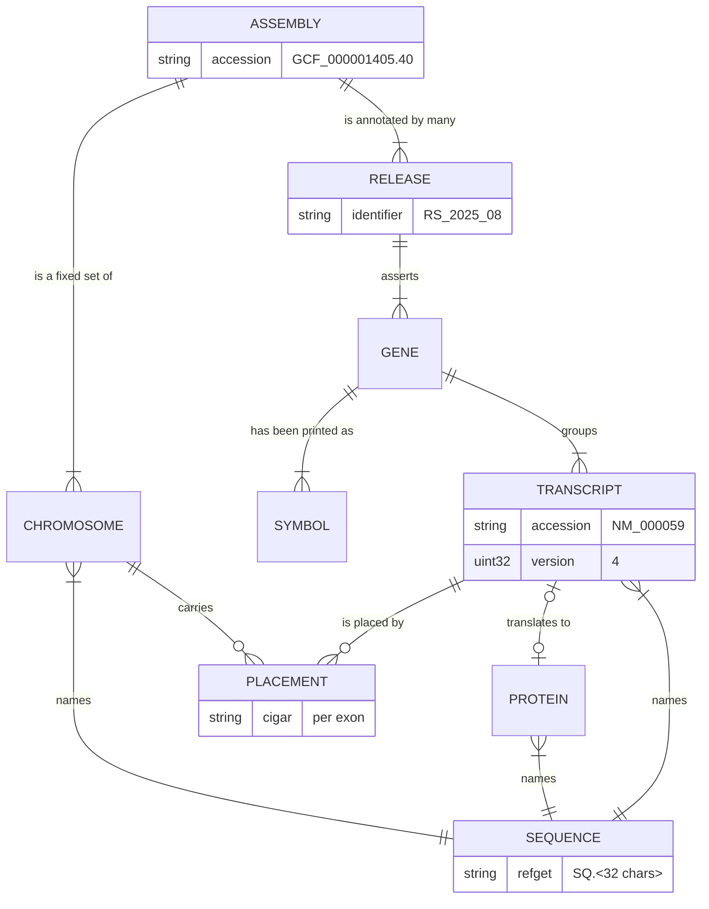

# The store

**Related:** [`../PRODUCT.md`](../PRODUCT.md) — the principles this design applies, and the package's shape;
[`placements.md`](placements.md) — what a transcript's placements and CDS are, and where each comes from;
[`retired-versions.md`](retired-versions.md) — the shard of replaced and suppressed versions stacked under a release;
[`../../GLOSSARY.md`](../../GLOSSARY.md) — bundle, shard, store, genome.

## Overview

weaver resolves a variant name by asking a data provider about transcripts: a transcript's model, a slice of its
sequence, the transcripts of a gene, the gene over a position, the sequence behind a digest. This doc decides how the
data behind those answers is laid out at rest, and why.

- **The gene is the unit of storage.** One bundle per gene holds every transcript, every protein, their alignments and
  the sequences they cite. Seven of the eight lookups a variant name can demand land on gene bundles; half the names in
  the literature name no transcript and so need a gene's whole inventory; and the gene is where the compression is.
- **A store is files, and its indexes are read into memory once.** No database and no service. A lookup is a search over
  bytes already in memory, then one ranged read of one bundle, from local disk or `gs://`.
- **Releases stack as shards behind one index.** Each annotation release is one immutable shard; an index over an
  ordered list of shards maps a key to every record holding it, because the same versioned transcript can sit under
  different genes in different releases.
- **A store is one assembly.** Placements are per assembly, and nothing crosses between stores.
- **The genome is cut into blocks**, so that a slice of a chromosome, or a transcript's exons together, is one batched
  read.

## Background

### How the entities relate

Nine entities carry the area. The layout has to serve the relationships between them, and two of them sit where a first
reading does not put them: a placement between a transcript and a chromosome rather than on the transcript, and a
sequence as a thing in its own right that accessions merely name.

**An assembly and an annotation release are different kinds of thing.** An assembly is a set of sequences, fixed once
published. A release is a claim *about* those sequences — where the genes are, which transcripts belong to them — and a
publisher issues many against one assembly. Nothing in a release changes the assembly; everything in a release can
change in the next.

**A gene has no sequence of its own.** It is an assertion a release makes: a name, a locus, a set of transcripts. Its
membership is the fastest-moving thing in this data — a quarter of Ensembl genes gain or lose a transcript in a single
release — so a gene is a good unit to *read* and a poor thing to treat as an identity.

**A transcript record is the durable identity.** Its accession and version name a string of bases the publisher will not
change: the version moves when the residues do. That is what lets a paper cite `NM_000059.4` and still mean something
exact years later.

**A placement is a relationship, not a property of the transcript.** The same record is placed on GRCh37 and on GRCh38,
in different coordinates and sometimes with different alignments, and within one assembly it can be placed on several
sequences ([`placements.md`](placements.md)).

**A sequence is identified by its residues.** A refget digest names bases — no accession, no publisher, no assembly. Two
accessions with the same digest hold the same sequence, which is what makes a MANE pair checkable rather than asserted.

### Where the clean model is wrong

Each of those relationships reads plausibly until it is counted. These are the ones that misbehave, measured on RefSeq's
GRCh38 release RS_2025_08 and on Ensembl releases 110 to 116.

| relationship         | the natural assumption               | what the data says                                                                                                                                                                       |
| -------------------- | ------------------------------------ | ---------------------------------------------------------------------------------------------------------------------------------------------------------------------------------------- |
| transcript → gene    | a transcript belongs to one gene     | one gene *within* a release, with no exceptions in either publisher — but 72 RefSeq and 2,969 Ensembl accessions move to a different gene across releases without their version changing |
| transcript → protein | several isoforms may share a protein | exactly one each — no `NP_` in the annotation is the product of two `NM_`                                                                                                                |
| sequence → accession | one name per sequence                | 19,437 MANE pairs are one sequence under a RefSeq and an Ensembl accession, and 407 sequences are cited from more than one gene                                                          |
| symbol → gene        | a symbol names a gene                | 4,241 spellings name more than one; for 1,217 the spelling is one gene's current symbol *and* another gene's alias or withdrawn symbol — `ACTB`, `ACAT1`, `ADA2`                         |
| gene → transcripts   | a handful each                       | 52.4% of genes have exactly one, and the largest has 368                                                                                                                                 |
| release → assembly   | a build has an annotation            | many releases per assembly, each superseding the last, none deleting it                                                                                                                  |

Two of these decide the layout. A symbol that names more than one gene means the identity crosswalk has to be carried
rather than inferred at lookup time. And a *versioned* accession that changes gene between releases means a key cannot
map to a single record once more than one release is held.

### What a variant name asks of the data

A name a resolver meets in the literature is not tidy HGVS. Over 120,521 names from a literature sweep (§Appendix):

| what the paper wrote                           | share | what it asks of the store                |
| ---------------------------------------------- | ----- | ---------------------------------------- |
| a versioned accession and a `c.` change        | 39.0% | that exact `accession.version`           |
| a change with no reference at all, `c.1521del` | 37.6% | every transcript of the gene             |
| a gene symbol and a change                     | 11.6% | the same                                 |
| an unversioned accession and a change          | 8.2%  | every version of that accession held     |
| a genomic position, `NC_…:g.` or `chr:pos`     | 1.0%  | every gene overlapping an interval       |
| a protein accession and a `p.` change          | 0.4%  | the transcript that produced it          |
| an Ensembl accession                           | 0.5%  | that exact `accession.version`           |
| an rsID                                        | 0.5%  | nothing here — an rsID names no sequence |

So the data has to answer eight lookups:

1. **A symbol, however it was spelled, to a gene** — withdrawn and alias spellings included, and with ambiguous
   spellings returned as a set rather than silently collapsed.
1. **A gene to all of its transcripts**, with the tags (MANE Select, MANE Plus Clinical) a caller orders them by: a bare
   `c.` change has to be tried against each until one validates the base it states.
1. **A versioned accession to the record itself**, including versions the current release has replaced.
1. **An unversioned accession to every version held.**
1. **A protein accession to its transcript**, to back-translate a `p.` change.
1. **A genome interval to the genes over it**, for `g.` names and positional keys.
1. **A refget digest to a sequence and back.**
1. **Residues at a coordinate** — of a transcript, to validate the base a name states; of a chromosome, to state the
   genome's own base.

The first seven end in the same place — a gene, and what it holds — however they start. Usually one gene: an interval
opens onto every gene over it, and a shared sequence onto every gene citing it, but the thing landed on is always a
gene. The eighth is served from the bundle for a transcript or protein and from the genome for a chromosome. And lookup
2 is the common path, not a convenience: the 49.2% of names that name no transcript can only be answered by a gene's
whole inventory, tried in order.

### Scale

RefSeq on GRCh38 is roughly 43,000 genes, 186,000 transcripts and 196,000 placements. Built, that is about 117 MB of
store beside about 890 MB of genome, and a lookup touches one gene or a handful. Nothing here is large enough to force a
decision, so the layout optimises for correctness and for the cost of the first read.

## Non-goals

- **A general sequence service.** The store answers what weaver asks of it. It is not a refget server or a
  sequence-collection registry.
- **Resolving identifiers that name no sequence.** An rsID labels a variant somebody observed, not a transcript or a
  position; resolving one means carrying dbSNP, about 15 GB even stripped to an identifier-to-allele table, for 0.5% of
  names. That crosswalk is the caller's.
- **A resolution policy.** The store returns every transcript of a gene and every record holding a key; which to try
  first, and which release to believe, is decided by the caller ([`../PRODUCT.md`](../PRODUCT.md)).

## Design

### A gene is one bundle

Reference data could be keyed per transcript. It is keyed per gene
([`bundle.proto`](../../proto/weaver_data_provider/v1/bundle.proto) is the contract), for three reasons, heaviest first.

**It is how a resolver reads.** Seven of the eight lookups land on gene bundles, and three of them want more of a bundle
than the record asked for: a bare `c.` change is tried against each transcript, a `p.` change is back-translated against
each, and an unversioned accession wants every version. Half the names arrive with no transcript named at all, so that
is the common path. Making the gene the unit turns what would be several reads into one.

**It is where the compression is.** A gene's isoforms are mostly the same bases. Compressing each transcript on its own
costs about four times what compressing a gene's transcripts together costs, and the redundancy is *within* a gene —
only 3% of 32-mers recur across genes — so no dictionary shared across the corpus recovers what putting the gene in one
unit gets for free (§Appendix).

**Identity is a crosswalk, and it belongs with what it identifies.** Papers print withdrawn symbols and aliases, so a
lookup by `ASA` or `SEPT9` has to land on the gene HGNC now calls `ARSA` and `SEPTIN9`; and since 1,217 spellings are
one gene's current symbol and another's alias, the answer is a set to disambiguate, not a redirect. The bundle carries
the gene's identity across the nomenclatures beside its transcripts, so every spelling resolves to the same place.

A bundle therefore holds one gene's identity, its transcripts with their alignments and coding bounds, its proteins, and
every distinct sequence those cite, stored once each and addressed by refget digest. One choice in it is worth stating
here: **a CIGAR reads in transcript orientation with the genome as the reference side**, so a base only the transcript
has is an insertion. VariantValidator displays the same alignment the other way round; neither is more correct, and a
reader comparing the two needs to know they are not disagreeing.

### A store is files, and it opens once

A store is the bundles, the key tables that find them, the interval tables for position queries, and a manifest naming
the shards and digesting every file. All of it is written in [bagz](https://github.com/google-deepmind/bagz), Google
DeepMind's container of independently compressed entries, each fetchable by a ranged read — so one bundle is read
without reading, or decompressing, its neighbours. The reader is
[`weaver_data_provider.store`](../../src/weaver_data_provider/store.py), and the tables' layout is
[`index.proto`](../../proto/weaver_data_provider/v1/index.proto).

The decision is that **the indexes are read whole at open and searched in memory**, rather than probed per lookup. Four
keys find a gene: its normalised symbol (previous and alias symbols included), a versioned transcript accession, a
versioned protein accession, and a refget digest. Each is a sorted table held as flat arrays, so loading it costs a read
and not a million small objects. What that buys:

- Finding a gene costs no request: a binary search over bytes in memory, then a ranged fetch of that one bundle.
- An unversioned accession is a prefix search over the sorted keys, so `NM_000059` finds every version held without a
  second index.
- A position query bisects an interval table twice — on where placements start, and on how far any of them could still
  reach — so a `g.` coordinate finds its genes without scanning a chromosome.

The cost is a fixed price at open: about 13 MB of tables read in roughly a tenth of a second for a GRCh38 RefSeq store,
and tens of megabytes resident after. For a process that answers thousands of names that is the right trade; for one
that answers a single name and exits, it is not. A service could sit in front of the store later — the reader is the
seam where one would go — but the data is static per release and small, so a service now would be one more deployment
between a caller and files it can read.

**The manifest is the store's identity.** It is written last, so its presence marks a complete store, and it records the
format version, the assembly, the shards in order, and a digest of every shard and index file. A reader checks each file
against it at open and refuses a mismatch, so an index rebuilt in place and interrupted, or a shard rewritten under an
index, fails loudly instead of answering the wrong gene. Object stores report these digests in metadata, so on `gs://`
the check is a metadata read, not a download.

### Releases stack as shards behind one index

A publisher issues many releases against one assembly, and names in the literature cite transcript versions that later
releases replaced. So a store has to be able to hold more than one release, and the question is what "more than one" is
shaped like.

**A release is a shard; an index spans an ordered list of them.** A bagz reader reads a list of files as one sequence of
records, so a store grows by writing one more shard rather than rewriting anything, and the index is rebuilt over the
longer list in seconds. Record numbers run in the order the manifest lists the shards, not in filename order, so the
order is data, pinned in the manifest. The replaced and suppressed versions a release no longer carries come from NCBI's
historical set, stacked as a shard of their own ([`retired-versions.md`](retired-versions.md)).

**A shard is immutable at its path, and named for its contents.** Every index that has ever named a shard relies on
those exact bytes: a shard rewritten at the same path renumbers every record an older index resolves. So a shard's name
ends in a digest of its contents — recutting a release with a new builder gives a new path by construction — and
rebuilding, reordering or merging shards is always a new index over new paths, never an overwrite. The manifest's
digests turn a violation into an error at open; immutability is what makes the reads after open safe.

**A lookup returns every record holding the key, not the newest.** Collapsing to the newest would be wrong, not merely
lossy: a versioned accession can sit under a different gene in a later release, so one key legitimately names two
records, and the index is the only place that fact survives. A key therefore maps to a run of record numbers, each
attributable to its release through the shard it falls in, and the caller chooses. The provider takes the newest record
holding a versioned transcript, a policy stated where it is applied
([`weaver_data_provider.provider`](../../src/weaver_data_provider/provider.py)).

### A store is one assembly

GRCh37 and GRCh38 are separate stores, and a store's alignments are only ever on its own assembly's sequences. A name in
build-37 coordinates is read against the GRCh37 store; carrying its allele onto GRCh38 is a liftover a caller makes
deliberately, never something the data does on its behalf. A third of the literature names state GRCh37 and over half
state no build at all, so an implicit lift would be both reachable and invisible.

What does cross is anything keyed on an accession. MANE's own coordinates are GRCh38, but 99.4% of the records it names
are in the GRCh37 release too, so its tags apply on both stores without either borrowing the other's positions.

### The genome is cut into blocks

Publishers ship genomes as gzip, which cannot be sliced: reaching a position means decompressing everything before it.
The genome builder rewrites the same sequences as fixed-size blocks of bases, each a zstd-compressed bagz entry, plus a
catalogue naming every sequence with its length and refget digest
([`genome.proto`](../../proto/weaver_data_provider/v1/genome.proto)). The reader,
[`weaver_data_provider.genome`](../../src/weaver_data_provider/genome.py), answers a slice by reading only the blocks it
covers, and gathers a transcript's exons — several slices of one sequence — in one batched read. The catalogue is
written last and so marks a complete genome.

The residues are untouched — soft-masking included — so a chromosome's refget digest here is the one every other
consumer of the assembly computes. The container changes, never the content.

## Alternatives considered

- **Key per transcript rather than per gene.** Appealing, because a versioned accession is the natural key of the
  problem: it is what a paper cites and what a projection starts from. Rejected on both counts that matter: several
  reads per resolution instead of one, and about four times the stored bytes for the sequences. Three attempts to win
  the compression back another way failed (§Appendix, Compression).
- **Merge the assemblies into one store.** A transcript record is assembly-independent — every accession.version GRCh37
  and GRCh38 share is byte-identical — so separate stores duplicate 44% of the residues. Rejected on proportion: the
  bundles are under a tenth of a reference footprint the genomes dominate, so the merge saves about 3%, in exchange for
  bundles carrying placements a reader did not ask for.
- **Fold every release into one bundle per gene.** Every read would carry history it does not want, and sequences are
  88% of a bundle.
- **A store per release, probed in turn.** Resident memory and probe count would grow with every release held, for a
  question most lookups never ask.
- **Parquet tables queried through DuckDB.** Competitive, and better at queries returning many rows, with a reader cache
  built in. It loses on bytes fetched per lookup and on a cold process's first answer, since the query engine reconnects
  per query, and it is larger than the gene bundles (§Appendix, Storage).
- **A database, or a service in front of the store.** Rejected for now rather than on principle: the data is static per
  release and the indexes fit in memory, so a service adds a deployment, a failure mode and a hop.
- **Hash-bucket index files.** Three times the bytes of sorted tables for the same keys, a round trip per probe, and no
  prefix search, which the unversioned-accession lookup needs.
- **bagz-index**, the companion extension that adds keyed lookup to a bagz file, in place of our own key tables. It
  publishes no wheels and needs a Rust toolchain.
- **bgzip for the genome**, the block-compressed gzip htslib indexes. It answers the same slices and standard tools read
  it. Not taken because everything else at rest is already bagz: one container means one reader, one way of reaching
  `gs://`, and one batched ranged read for a transcript's exons.

## Appendix

### Literature replay

120,521 variant names from a literature sweep, each with a gene symbol and sometimes a genome build, replayed against
what VariantValidator had produced for them: the GRCh38 positional key, the validated `c.` name, and the predicted `p.`
name. Resolved with weaver over GRCh38 and GRCh37 stores. The name shapes in Background are counted over the same rows.

| agreement, over the 101,513 names VariantValidator had keyed | share |
| ------------------------------------------------------------ | ----- |
| positional key, exact                                        | 96.2% |
| `c.` name, ignoring the transcript version                   | 97.1% |
| `p.` name, ignoring the protein version                      | 96.5% |

The 101,513 split three ways: 97,631 keys agreed, 2,406 came out different, and 1,476 were not keyed at all — mostly
names that did not parse, accessions retired from the current release, and cited versions whose record no longer
validates the stated base. Of the 2,406, 1,567 are errors in the comparison set itself, its transcript on a different
chromosome from the gene it is filed under; 462 are protein changes more than one codon change would produce; 175 are
coordinate shifts between a cited version and the current one; and 138 are a different transcript chosen for a bare `c.`
name. Excluding the comparison set's own errors, key agreement is about 97.7%. 21,239 of the names — one in five — cite
a transcript version the current release has replaced.

### What changes between releases, and between assemblies

RefSeq figures compare RS_2025_08 against release 110; Ensembl compares 116 against 115 and against 110.

| measure                                                                    | result                 |
| -------------------------------------------------------------------------- | ---------------------- |
| RefSeq accession.versions in two releases with identical sequence          | 169,411 of 169,411     |
| RefSeq accessions whose version differs between them                       | 555 (0.3%)             |
| RefSeq alignments that moved for an unchanged accession.version            | 475 of 90,501 (0.52%)  |
| RefSeq transcripts reassigned to another gene, at an identical version     | 72 of 169,328 (0.04%)  |
| RefSeq transcripts under more than one gene within one release             | 0 of 186,077           |
| Ensembl transcripts retained from release 110 to 116                       | 99.6% (914 dropped)    |
| Ensembl genes whose membership changed, one release apart                  | 16,306 of 63,464 (26%) |
| Ensembl transcripts reassigned to another gene, one release apart          | 18 (0.004%)            |
| Ensembl transcripts reassigned six releases apart, at an identical version | 2,969 (1.2%)           |

A release changes little, which is why an older release supplies almost no replaced versions: of the 21,239 replayed
names citing one, merging release 110 serves 242 (1.1%) while NCBI's historical set serves 21,238. Gene membership
churns far faster than transcript identity, and it is the reassignments at an unchanged version that force a key to map
to more than one record.

### Storage

One transcript with its exons and CIGARs, fetched from a laptop 53 ms from the bucket.

| shape                                | requests | bytes fetched | first answer |
| ------------------------------------ | -------- | ------------- | ------------ |
| bagz, entry offsets preloaded        | 3–4      | 0.5 KB        | 150–210 ms   |
| Parquet + DuckDB, metadata cache on  | 1.5      | 105 KB        | ~290 ms      |
| Parquet + DuckDB, metadata cache off | 4        | 442 KB        | —            |

Read the request counts as a comparison between the two storage shapes, not as the store's cost per lookup: the bagz
shape measured still consulted an index in the bucket, which is where its extra requests went and the round trip the
in-memory key tables remove. The axes it settles — bytes fetched and a cold process's latency — do not depend on how the
index is held. On size, the gene bundles take 131 MB, Parquet 186 MB, and one bagz entry per transcript 448 MB, so the
gene decision and the format decision are separable.

### Compression

20,000 consecutive mRNAs, in bits per base: 2.64 compressed per transcript, 2.40 per transcript with a corpus-trained
dictionary, 0.70 per transcript with the gene's longest isoform as dictionary, and 0.66 for the gene as one block.

The three attempts to rescue per-transcript keying, and why each failed:

- **A dictionary of every MANE Select.** Almost no gain (2.42 bits per base against 2.49 unaided): a 71 MB dictionary
  over a four-symbol alphabet saturates the matchfinder, and it is not a window limit — 8 MB, 128 MB and long mode are
  identical.
- **Each transcript's own gene representative as its dictionary.** Works, but the representative has to be stored
  separately, and the total lands 38% *worse* than the gene block.
- **Two bases to the byte.** Quadruples the effective match length, still does not make a dictionary fire, and costs the
  gene block a third of its ratio, because packing forbids three quarters of the offsets and the block wins on long
  matches at arbitrary offsets.

The gene block is the per-gene dictionary scheme with the dictionary amortised, and accumulated context beats any fixed
reference.
